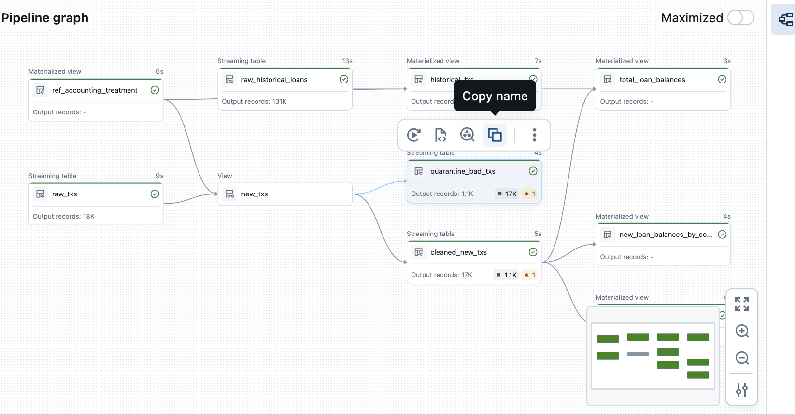

# Summary of Learnings from the Lab

## 1. Setting Up a Git Repo
- Cloned an existing repository using sparse checkout to optimize file selection.
- Accessed course materials from a GitHub folder.

## 2. Declarative Pipelines in Databricks
- Explored declarative pipelines using SQL.
- Learned the difference between **Streaming Tables (ST)** and **Materialized Views (MV)**.
- Understood the **CTAS (Create Table As Select)** pattern.

## 3. Using the New Pipeline Editor
- Enabled the new editor for enhanced workflow management.
- Explored features such as custom directories, pipeline configurations, and flexible source code integration.
- Defined, configured, and executed a pipeline.

## 4. Pipeline Execution & Monitoring
- Ran a pipeline and examined sample data, table metrics, and performance insights.
- Configured catalog/schema settings for organized data storage.
- Analyzed the pipeline graph to understand table relationships.

## 5. Streaming Pipelines
- Monitored incremental data ingestion and selective table updates.
- Used "Full Refresh" to recompute all tables and backfill data.
- Considered transitioning **Materialized Views to Streaming Tables** for real-time processing.

## 6. Unity Catalog and Lineage
- Explored **Unity Catalog** for lineage tracking and governance.
- Verified table metadata and schema details.

## 7. Serverless Compute in Databricks
- Executed notebooks with **Spark on serverless compute**.
- Used **Databricks Assistant** for explanations, documentation, and debugging.

## 8. Delta Tables and DWH Views
- Learned how **Delta Tables unify Data Warehousing, Streaming, and Machine Learning**.
- Accessed and analyzed pipeline-generated Delta tables.

---

This lab covered foundational concepts in **data engineering, pipeline orchestration, and streaming workflows** within Databricks. Let me know if you need deeper insights on any section!
